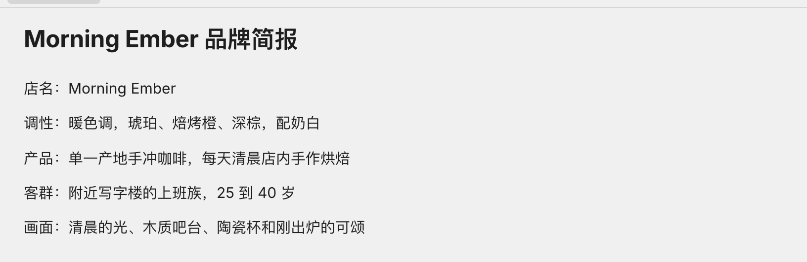
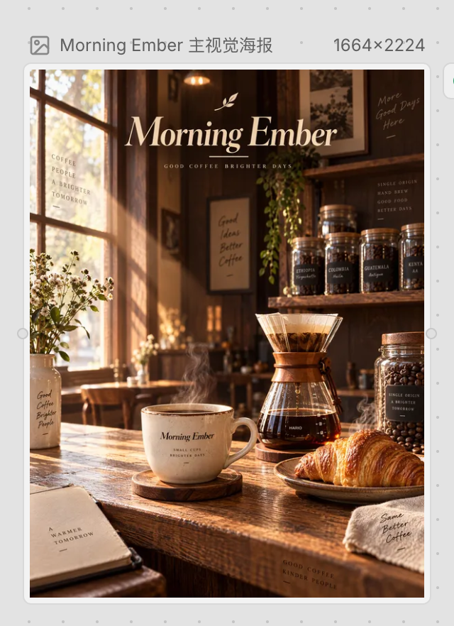

# Breatic 使用指南

[English](USAGE.md) | **简体中文** · [产品介绍](../README-CN.md)

在桌面浏览器中使用 Breatic。使用官方在线产品时先[注册或登录](https://breatic.ai/login)；自行部署时先完成[个人与局域网指南](../self-host/LOCAL-CN.md)，开发者请使用[开发环境指南](../self-host/DEVELOPMENT-CN.md)。

## 创建第一个项目

安装完成后：

1. 在桌面浏览器中打开实例地址，注册账号并完成个人 Studio 设置。启用了邮件时，输入邮件里的 6 位验证码完成注册；未启用邮件时，保存注册后显示的恢复码。没有共用的默认密码，也没有免登录模式。开通了付费的实例上，注册表单还有一个选填的推广码，从推广者的专属链接进来时会自动填好。
2. 为要创作的内容创建项目，选择初始 Space 类型。
3. 点击项目 Space 栏中的 **+**，添加 **Document** Space，命名为“剧本与创作简报”，写下故事或需求。如果初始 Space 已选文档，直接使用它即可。
4. 按场景或创意方向添加一个或多个 **Canvas** Space，分别命名，上传参考素材或添加节点，开始创作。
5. 通过标签页切换 Space，通过 Space 列表查找、管理项目中的其他空间。使用聊天和画布工具，通过已配置的模型生成、调整资产。
6. 与允许访问该实例的协作者分享项目，并设置他们的访问权限。

Space 标签最左侧的小 loading 表示当前浏览器已知该 Space 有工作正在进行，包含已反映到本端的协作者任务。切到其他 Space 后，原标签继续更新；悬停忙态标签可查看完整名字和运行状态。

如果加入的是现有实例，直接使用部署者提供的地址，从注册账号开始，不需要另外部署。部署者应在邀请用户前，完成部署指南中的登录、持久化、协作、上传和生成检查。

## 在 Breatic 中工作

- **编写创作计划：** 在 Document Space 中用标题划分场景、列表记录镜头描述、待办列表跟进制作任务。选中文字进行格式调整，或使用下方的文档快捷键。
- **添加与排列内容：** 上传参考素材，或在画布空白处右键选择节点类型。拖动节点调整位置，在空白处拖拽框选区域。
- **浏览画布：** 鼠标滚轮或触控板双指滚动用于平移；双指捏合或 `Ctrl+滚轮` 用于缩放。视图工具栏提供缩放、适应窗口、网格吸附和小地图。双击空白画布不会缩放。
- **处理选中节点：** 右键节点或选区，查看复制、创建副本、分组、重命名、锁定/解锁、下载、删除等可用操作。菜单由当前选区和权限决定，并非每种节点都有所有操作。
- **生成与调整：** 选择已配置的模型，提供提示词及所需参考素材，等待任务产出后继续处理。即使应用服务健康，缺少供应商凭据或额度仍可能阻止生成。
- **和 Agent 一起做：** 在对话面板告诉 Agent 你想做什么。它会先用一张问卷问清只有你知道、它也看不到的事，比如你的角色是谁、有没有需要对齐的已有作品。外观这类取决于喜好的部分，它会按最低价设置给出两三版不同的试稿，并说明各要花多少；你选定一版后，它再安排后面的步骤。它的提议以卡片形式出现：不按卡片上的按钮就不会放置，不开始生成就不会生成。
- **给 Agent 写长期要求：** 对话面板顶部的卷轴图标（**Project 指令**）打开一段纯文本，这个 Project 里每个成员、每次对话发出的每条消息都会把它一起发给 Agent，比如用什么语言回答、保持什么风格。Owner 和 Editor 可以修改；按 **保存** 后从下一条消息起生效，保存空内容即清除；Project 有指令时图标上会显示一个小圆点。
- **看哪些对话还在回答：** 在对话列表里，Agent 还在回答的对话（不论在这个页面、另一个标签页还是你的另一台设备上），名字前的小圆点会变成一个转动的小圈，回答结束后变回圆点。
- **协作与保留工作：** 画布修改通过协作服务同步。离开前确认同步和上传已经完成；浏览器断线或任务尚未结束，不能视为内容已经保存。验收持久化时应刷新并重新打开项目。

当前 Project 已打开的 Canvas 或 Document 还有本浏览器中的修改未同步，或上传等依赖当前页面的操作仍在进行时，点击连接提示条的“刷新”会要求确认，取消会保留当前编辑。通过应用内导航离开时，可以选择“留下”或“仍然离开”。两类工作都完成后，已打开的确认框显示“可以继续”并等待选择。浏览器自身刷新或关闭时，确认框是否出现受浏览器交互条件限制。

## 在 Timeline 中编排素材

创建 Project 或新增 Space 时选择 **Timeline**。卡片上的 **DEV** 表示编辑器正在开发中。编辑器在轨道上编排视频、图片、音频、文字和网页动画副本：最下面一条是“主轨”，其上依次是“轨道 2”“轨道 3”等，任何轨道都能放任何种类的片段。预览按轨道从下往上叠放播放头所在位置所有有画面的片段（音频以外的各种），每个图层按自己的位置、大小和角度摆放，所有片段按同一个时钟一起播放。左侧是预览、播放条、工具栏和轨道，右侧面板是选中片段的属性。

| 控件或操作 | 结果 |
| --- | --- |
| 工具栏 | 一排图标按钮，鼠标悬停显示名称，有快捷键的跟在名称后面：“添加素材”“添加网页动画”“添加文字”“撤销”“重做”“分割”“复制”“删除”靠左，三个开关和“缩放”滑杆靠右。工具栏放不下时，最右边的控件依次收进行尾的“更多”菜单（三个点），菜单里每项显示图标、名称和快捷键；工具栏变宽时它们回到原处。 |
| “添加素材” | 打开素材对话框：选择“Project 素材”或“本地上传”，并在“视频”“图片”“音频”之间选种类。Project 列表显示本 Project 已登记的该种类文件，图片带宽高，视频和音频带时长；“加载更多”读下一页。本地文件点击“选择视频”“选择图片”或“选择音频”。 |
| 选择“轨道”、填写“开始帧”并点击“添加到 Timeline” | 确认轨道和整数帧位置并添加片段（主轨磁吸开启时，主轨上的开始帧决定插入位置，主轨保持首尾相接）。视频和音频放完整个文件，图片放一段固定时长，两端可以拉长。轨道默认为选中片段所在轨道或主轨，开始帧默认为当前序列末尾，每次添加产生独立片段。 |
| 本地文件 | 立即以文件名放成一个虚线片段，对话框关闭，文件在后台上传，期间 Space 标签显示转圈。片段显示“上传中”和进度，文件交给服务端后显示“处理中”，之后按文件的实际种类变成视频、图片或音频片段，Space 里所有人都看得到。文件交给服务端以后，上传者关了页面上传也会完成。上传失败时片段变红并显示“上传失败”，重新发送同一文件有用时，上传者页面的属性里提供“重试”。 |
| “添加文字” | 在播放头处放一段写着“默认文字”的文字，时长固定，放在主轨以上、那里所有要画出来的片段上方第一条空着的轨道，或放到新的顶层轨道。新文字被选中，光标停在它的“正文”框里。预览把文字各行在画面居中画出，再按它的位置、大小和角度摆放。 |
| 点击片段 | 选中片段；右侧面板显示“轨道”“开始帧”“入点（帧）”（视频、音频和网页动画副本）“时长（帧）”，以及文件按 Timeline 帧率计的帧数，图片和文字显示“时长不限”，网页动画副本改为显示它来自的要求。输入整数帧后按回车或离开输入框即生效。文字还显示“正文”（离开输入框时生效）和“字号（px）”。视频和音频还显示“音量”（0% 到 398%，松手时生效）和“静音”。音频以外的片段还显示“位置与大小”：“X（px）”“Y（px）”以 Timeline 画面的像素计，“宽度缩放（%）”“高度缩放（%）”取 1 到 10000，“旋转（°）”，以及默认开启的“锁定比例”开关，开启时改一个缩放，另一个按原比例跟着变。片段不在播放头所在帧时，这一组显示“这个片段不在当前帧。” |
| 在预览里点击图层 | 选中鼠标下最上层的图层对应的片段；点在所有图层之外取消选中。选中的图层显示带手柄的选框：在框内拖动移动它，拖方形的角等比缩放，拖边中间的圆形手柄拉伸这一边，拖上方的圆形手柄绕中心旋转。“自动吸附”开启时，图层的边和中线吸到画面的边和中线，并显示参考线。每次松手是一步撤销，拖动中按 Esc 取消。Viewer 不能在预览里点选或拖动图层。 |
| 拖动片段 | 改变时间位置、拖到其他轨道换轨，或拖到最上方虚线行新建轨道。拖动选中片段的两端可以裁剪：图片和文字两端可以任意拉长，视频和音频最多拉到文件的长度。 |
| “撤销”“重做”“分割”“复制”“删除” | 撤销或重做自己的编辑，在播放头处分割选中片段，在其后紧接着放一份副本，或删除选中片段。 |
| “缩放”旁的三个开关 | “主轨磁吸”让主轨片段首尾相接，“自动吸附”（N）让拖动的边缘对齐片段边缘、播放头和第 0 帧，“联动”让主轨片段上方的片段（包括音频）随它移动或删除。 |
| “播放”“暂停”和预览滑杆 | 播放编排、暂停或选择全局帧。视频、图片、文字、音频和网页动画副本按同一个时钟播放，播放头上的视频和音频同时发声，各按自己的音量。当前位置和片段长度以“时:分:秒:帧”显示。任何一层还没准备好（视频或音频在加载、图片在解码、文字的字体在加载）时保持当前帧，时间显示上方出现小字“缓冲中…”。读取失败的视频、图片或音频在预览右上角按轨道提示，例如“音频读取失败”，并提供“重试”；其他图层照常播放，重试只重新加载这一层。字体读不到的文字用后备字体照常画出。浏览器阻止有声播放时，播放暂停并提示“浏览器阻止了有声播放，请按播放开始。”编辑器变窄时播放条分几步收窄：比例菜单只显示比例，然后播放按钮只显示图标，然后只显示当前时间，然后不显示时间，最后比例菜单只显示一个图标。 |
| 播放条右端的比例菜单 | 显示画面的比例和尺寸，例如“16:9 · 1920×1080”，可选 16:9、9:16、1:1、4:3、4:5、2:3 和 21:9；新建的 Timeline 为 16:9。选择后 Space 里所有人的画面一起改变，是一步撤销；黑色预览画面变成这个形状，每个图层相对画面的位置、缩放和旋转保持不变。画面尺寸不在其中的 Timeline 显示实际尺寸，不勾选任何比例。Viewer 看到的菜单不可用。 |
| “添加网页动画” | 打开本 Project 已完成的网页动画列表，每次打开都重新读取，并按制作它们的 Space 分组：先是各个 Motion Space，然后是 Motion 出现之前在 Timeline 里做的，最后是“已删除的 Space”。点击一行，在播放头处放一份独立副本，放在主轨以上、那里所有视频、图片和文字上方第一条空着的轨道，或放到新的顶层轨道；列表随之关闭，再次打开并点击同一行会再放一份副本。“去 Motion 制作”打开最新的 Motion Space，Project 里没有时新建一个名为 Motion 的 Space。每个副本像视频片段一样编辑；改动或删除一个副本不影响其他副本和这条网页动画。Motion 出现之前由 Timeline 放入、绑定在一次没有完成的运行上的副本，运行期间显示为虚线，失败、取消或过期后显示为红色；它的属性写明原因并提供“在 Motion 中打开”，打开后在“失败”下突出显示这次运行。 |
| 从 Space 列表重开关闭的 Space | 继续读取共享 Timeline 文档；Viewer 可以查看和预览，编辑按钮对其不可用，也看不到“添加网页动画”和“添加文字”。 |

快捷键：左右方向键将选中片段移动 1 帧（按住 Shift 移动 1 秒），主轨磁吸开启时主轨片段改为与前后片段对调；未选中片段时移动播放头；Alt+上/下换轨；Delete 或 Backspace 删除；Cmd/Ctrl+D 复制；Cmd/Ctrl+B 分割；Cmd/Ctrl+Z 撤销，Cmd/Ctrl+Shift+Z 或 Ctrl+Y 重做；N 开关自动吸附；拖动中按 Esc 取消。本地文件上传期间，上传者在片段属性里看到进度。服务端判定上传失败时，所有成员的片段属性里都写明原因；文件没送到服务端就失败时，只有上传者的属性里写明原因。已经交给服务端的文件，上传者离开后照样上传完成；只有上传者在文件交给服务端之前离开，片段才变灰并显示“未完成”，有编辑权限的人可以删除它。上传完成之前，预览不画这类片段，只显示一条写明轨道的提示。

Timeline 视频导出属于后续计划。

## 在 Motion 中制作网页动画

创建 Project 或新增 Space 时选择 **Motion**。卡片上的 **DEV** 表示它正在开发中，网页动画只在开启该功能的部署中可用。网页动画是由模型编写的动画网页，按时钟播放，可以导出为视频。当前显示的结果铺满整个 Space；所有控件都以图标按钮放在底部的一条浮动栏上，鼠标悬停显示名称。

| 控件或操作 | 结果 |
| --- | --- |
| “新建” | 打开对话框：“要求”“引擎”（DeepSeek）、“比例”（16:9、9:16 或 1:1）和“时长（秒）”。点击“执行”开始运行；当前显示的结果保持不变，执行列表打开在“进行中”，并突出显示新的运行。被拒绝的运行保留已填写的内容并写明原因。用量在运行结束时结算。 |
| “执行列表” | 打开执行列表，分“已完成”“进行中”和“失败”，各显示数量；按钮上显示进行中的运行数。点击“已完成”下的一行即显示该结果。进行中的行显示当前步骤，本 Project 的运行还提供“取消”；“失败”下的行（失败、取消或过期）写明原因并提供“重新执行”，按原内容重新打开对话框，视频则提供“重新导出”。Motion 出现之前在 Timeline 里做的运行列在每个标签页末尾的“以前在 Timeline 里做的”下。 |
| 播放、时间和滑杆 | 播放并定位当前显示的结果。每条批注在滑杆上有一个小标记；悬停标记显示批注内容，点击打开它。 |
| “修改” | 描述要对当前结果做的改动，可另选比例或时长；运行产生一个新结果，当前结果及其批注保持原样。 |
| “导出视频” | 在本 Space 中把当前结果渲染成视频；列表打开在“进行中”，并突出显示这次导出。导出制作中或完成后，按钮显示为“查看视频”。 |
| 视频完成后：“下载”“放到 Canvas”“查看源动画” | 下载视频；把视频放到所选 Canvas 上次视图的中央附近（提示消息里的“查看”打开该 Canvas 并选中视频）；或显示它所渲染的网页动画。在 Canvas 上，视频节点的“打开源动画”让 Motion Space 回到该结果。 |
| “添加批注” | 在当前时间暂停，点画面标出位置或直接书写，然后发送。“批注”打开本 Space 的批注列表，按结果分组、按时间排序；点击一条会在对应时间显示该结果和批注卡片，可在卡片上回复、解决或重新打开。Space 里的所有人在批注写下时就能看到。 |
| 详情按钮（三个点） | 显示结果的名称、要求、步骤、用量；修改得到的结果还显示它修改自哪个结果。 |

Viewer 可以打开两个面板、播放、阅读批注和下载视频。

## 布置 3D 场景

创建项目或添加 Space 时选择 **3D**。类型依次为 Canvas、Document、3D、Timeline、Motion，默认选中 Canvas。3D、Timeline 和 Motion 卡片带有 **DEV** 标记；以此类型创建项目时，初始 Space 名称为 **3D**。

| 控件或操作 | 结果 |
| --- | --- |
| 左侧“添加”按钮 | 打开内置对象菜单，添加立方体或人形。 |
| 左侧上传箭头按钮 | 打开“导入模型”，选择 glTF、GLB 文件、文件夹或 ZIP；上传进入任务面板，所有成员都可把模型放入场景。 |
| 左侧闪光按钮 | 打开“AI 生成”：在左下角的模式按钮里选 Text to 3D 或 Image to 3D，写提示词，或从电脑、Project 填入正、左、后、右视图，调整设置后按圆形生成按钮。打开“绑定骨骼”会得到带骨骼、可以摆姿势的模型，估价会包含这一步。这次生成进入任务面板。 |
| 点击对象，Shift 点击更多对象 | 在视口或场景对象列表中选择对象；点击场景空白处清除选择。 |
| 下方中间的选中对象菜单 | 选择移动、旋转或缩放后拖动场景中的原生手柄；定位、复制副本或删除选中对象。多选对象使用等比缩放。场景画面太窄、放不下它和右下工具条并排时，它移到右下工具条正上方。 |
| 右侧属性面板 | 编辑单个对象的名称、以米计的位置、以度计的旋转及正数缩放。Enter 或离开字段时提交，Escape 取消草稿。带骨骼的模型多一个“姿势”区：人形角色可用站立、坐下、躺下、行走、挥手预设，另有“调整关节”开关和“恢复默认姿势”。 |
| “外观”区（模型的属性面板） | 列出模型的部位；在列表里点，或在场景里点已选中模型的某处，选中这个部位，它会为你高亮并展开设置。“哑光”“光泽”“金属”“拉丝金属”“玻璃”“橡胶”一键设好质感；“颜色”和“发光”旁边显示数值，点色块打开取色器；“光泽”“金属感”“透明度”“透光”“发光强度”是滑块。“图片”下有“选择图片”（Project 里的图片，或电脑上的 PNG、JPEG、WebP）；有图之后“选择图片”变成“换一张”，并多出“移除”“平铺”“偏移”“旋转”。从电脑选的图在后台上传，部位显示上传进度；文件还在传送时不能关闭这个 Space，传完后即使关掉 Space，图也会落到这个部位上。滑块和颜色按住时预览，松开才写入。“恢复这个部位”和“全部恢复”回到模型自带的外观。 |
| 调整关节 | 圆点标出角色的关节。点击圆点或身体部位选中关节，再拖动上面的旋转环；拖动过程中协作者能看到关节在动。Escape 先退出调整关节，再关闭面板；选择移动、旋转或缩放也会退出。 |
| 面板关闭按钮旁的锁图标 | 锁定或解锁选中对象，Editor 可解锁其他协作者锁定的对象；副本初始为解锁状态。 |
| 右下工具条 | 从左到右为撤销、重做、属性、场景对象、任务、导演台、取景框按钮、小地图开关。面板入口切换对应右侧浮层，浮层关闭按钮也可收起面板。打开着的面板，它的按钮显示为选中。有导入或生成在进行（含排队等待的）时，“任务”按钮右上角显示数量（超过 99 显示 99+），Space 标签显示转圈，全部结束后两者消失。 |
| 小地图 | 点击场景俯视图，移动自己的浏览相机。取景时小地图收起，开关不可用。 |
| 取景框按钮（右下工具条里的四角框图标） | 打开取景框，截一张场景图拿去生成。框外变暗，打开着的右侧面板关闭且之后不再自动打开，小地图和左侧栏收起，选中对象不再自动打开属性面板。框下菜单可选画幅（Free、16:9、9:16、1:1、4:3、3:4、3:2、2:3，默认 16:9），显示出图尺寸（长边 2048），有“取消”和“确定”。拖四个角缩放：方形角点保持比例，Free 下的圆形角点可分别改宽高。视角仍可转动缩放。“确定”截下不含网格、手柄、选中框和关节点的画面；模型还在加载时先提示。截图后框里显示截下的图，对象工具栏收起到“重新取景”为止，菜单显示“添加到 Agent”“添加到 Canvas”“复制”“重新取景”。“添加到 Agent”把图附到当前对话；“添加到 Canvas”列出 Project 里所有 Canvas（只有一个也要点选），在选中的 Canvas 上放一个图片节点，无论它的标签是否打开，提示里的“查看”会打开那个 Canvas 并选中节点；“复制”把 PNG 放进剪贴板。图交出去就关闭取景框：进了对话附件、作为图片节点写上 Canvas，或进了剪贴板。上传在附件或节点上继续，结果由它们显示。交不出去时停在截图处可以再试。再点取景框按钮或按 Esc 关闭；截图后按 Esc 回到取景。Viewer 不能使用。 |
| 右侧“导演台”面板 | 设置这个 Space 里所有人共用的机位和灯光。“机位”下的加号把当前视角存为机位；每台机位的卡片显示实时画面、焦距和画幅，“更多”菜单里有“属性”“复制副本”“锁定”“删除”。点击画面即从这台机位看，取景框按它的画幅显示：拖动会移动这台机位，“退出机位”回到自己的视角。“灯光”下的加号可添加平行光、点光或聚光，数量有上限；每一行显示颜色点、名称、类型和“投影”开关，点击颜色点、名称或类型选中这盏灯，它会显示描边并展开“名称”“颜色”“强度”、聚光的“角度”和“锁定”。“环境光”下是颜色和强度。滑块和颜色按住时预览，松开才写入；按住时按 Esc 放弃这次改动。Viewer 可以看卡片和从机位看。 |
| 任务面板 | 列出所有成员的导入和生成，新的在前，可筛选。完成的行有“放入场景”；模型已在场景里的行有“在场景中定位”，会选中全部副本并把视角移过去。失败的生成可“重试”或“移除”。要求绑定骨骼的生成会说明骨骼是否绑定成功；只有这一步失败时，模型照常交付，只按生成计费。 |
| Agent 建议 | 让 Agent 生成 3D 模型；它给出的卡片会打开当前 3D Space 的“AI 生成”对话框并填好内容。 |
| 批注 | 悬停灰色批注按钮，说明批注仍在开发中。 |

协作者共享场景对象，选区、浏览相机和撤销历史归各用户所有。Viewer 可以浏览和选择对象。多个 Editor 可同时编辑未锁定对象，选中或拖动时保持这一协作方式。切换 Space 保留当前协作文档、个人选区和撤销历史，同时释放隐藏视口；关闭 Space 标签释放该会话。上次浏览相机按账号、Project、Space 保存在当前浏览器中。

切换 Space 保留未完成的属性输入，返回后重新打开属性面板继续编辑。关闭面板、打开其他面板或浮层、改变选区会结束该输入。打开顶栏菜单后，键盘焦点进入菜单。

## 操作快捷键

Studio 页和 Project 页顶栏铃铛旁的 **?** 按钮可打开**用户手册**和**联系支持**（support@breatic.ai）；登录类页面的页脚也有这两个链接。在画布中，左侧菜单底部的**快捷键**按钮列出当前平台的全部画布快捷键和手势；Viewer 只看到对自己生效的那些。在 3D Space 中，左栏底部的**操作说明**按钮说明 3D 操作方式。

画布快捷键只在画布空间拥有键盘焦点时生效，不会替代聊天框、文本输入框或编辑器内的输入操作。编辑操作需要写权限，锁定状态或运行中的任务可能限制删除。使用画布快捷键前先点击画布。

### 画布

| 操作 | macOS | Windows / Linux |
| --- | --- | --- |
| 复制选中节点 | `Cmd+C` | `Ctrl+C` |
| 粘贴支持的剪贴板内容 | `Cmd+V` | `Ctrl+V` |
| 创建选中节点的副本，不替换剪贴板 | `Cmd+D` | `Ctrl+D` |
| 撤销画布修改 | `Cmd+Z` | `Ctrl+Z` |
| 重做画布修改 | `Cmd+Shift+Z` | `Ctrl+Shift+Z` 或 `Ctrl+Y` |
| 将符合条件的选区分组 | `Cmd+G` | `Ctrl+G` |
| 取消选中组的分组 | `Cmd+Shift+G` | `Ctrl+Shift+G` |
| 删除允许删除的选中节点 / 连线 | `Backspace` 或 `Delete` | `Backspace` 或 `Delete` |
| 取消正在进行的参考选择或批注放置 | `Esc` | `Esc` |

复制粘贴可能依赖浏览器剪贴板权限与安全上下文，局域网使用应按指南配置可信 HTTPS。`Cmd/Ctrl+A` **不是全选画布节点**：在可编辑内容之外，项目会拦截网页全选，请使用画布选区操作。

### 3D

以下快捷键在 3D Space 拥有键盘焦点且当前未编辑文本字段时生效。编辑操作需要写权限，共享修改受对象主动锁约束。

| 操作 | macOS | Windows / Linux |
| --- | --- | --- |
| 复制选中对象的副本 | `Cmd+D` | `Ctrl+D` |
| 删除选中对象 | `Backspace` 或 `Delete` | `Backspace` 或 `Delete` |
| 撤销自己的场景修改 | `Cmd+Z` | `Ctrl+Z` |
| 重做自己的场景修改 | `Cmd+Shift+Z` | `Ctrl+Shift+Z` 或 `Ctrl+Y` |
| 定位选中对象 | `F` | `F` |
| 取消或收起 | `Esc` | `Esc` |

Escape 先取消当前字段草稿、按住的滑块或颜色、拖动中的机位，或变换手势，再次按下时收起已打开的面板；取景框打开时接着处理取景框（截图后回到取景，取景中关闭），随后清除选择；从机位看时，Escape 先退回取景框这一步（取景中即退出机位），面板保持打开。失去焦点、隐藏场景或失去写权限会取消未完成的变换手势。

### 文档编辑

以下快捷键作用于文档编辑器内部，不用于操作画布节点。macOS 的 `Option` 也可能标为 `Alt`。

| 操作 | macOS | Windows / Linux |
| --- | --- | --- |
| 加粗 / 斜体 / 下划线 | `Cmd+B` / `Cmd+I` / `Cmd+U` | `Ctrl+B` / `Ctrl+I` / `Ctrl+U` |
| 删除线 | `Cmd+Shift+S` | `Ctrl+Shift+S` |
| 行内代码 | `Cmd+E` | `Ctrl+E` |
| 正文段落 | `Cmd+Option+0` | `Ctrl+Alt+0` |
| 一级 / 二级 / 三级标题 | `Cmd+Option+1` / `2` / `3` | `Ctrl+Alt+1` / `2` / `3` |
| 无序列表 | `Cmd+Shift+8` | `Ctrl+Shift+8` |
| 有序列表 | `Cmd+Shift+7` | `Ctrl+Shift+7` |
| 待办列表 | `Cmd+Shift+9` | `Ctrl+Shift+9` |
| 代码块 | `Cmd+Option+C` | `Ctrl+Alt+C` |
| 引用 | `Cmd+Shift+B` | `Ctrl+Shift+B` |
| 退出全屏打开的表格 | `Esc` | `Esc` |

### 聊天

| 操作 | 快捷键 |
| --- | --- |
| 发送当前消息 | `Enter` |
| 插入换行 | `Shift+Enter` |

使用输入法时，按 Enter 确认正在组词的候选内容不会发送消息。是否允许发送仍取决于当前输入和任务状态。

## 实例：从简报到视觉素材

以下截图来自公开的咖啡店教程，展示文档与画布之间的创作流程。

1. 在 Document Space 中写下目标受众、产品卖点和视觉方向。

   

2. 将相关上下文提供给 Agent，讨论画面并评审提案。在画布中选择可用模型，调整提示词和参考素材，再生成资产。
3. 比较或调整结果，下载选定素材，用于最终制作。

   

这个实例展示生成图片，而不是已剪辑完成的视频。结果、模型可用性和费用取决于已配置的供应商。完整操作见[官网教程](https://breatic.ai/zh-CN/tutorials)。
